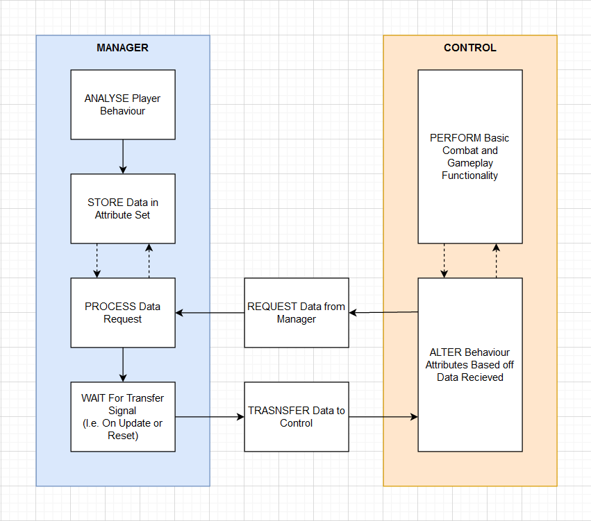

# Adaptive AI Difficulty
### Matt Law - COMP 250

## Introduction
Given the opportunity, players will optimise the fun out of a game. Whether its using only the highest rated strategies or abusing the mechanics to make the game a lot easier. To prevent the former, I've developed an AI agent for a simple FPS that will adapt to how the player is playing in order to force them to switch up their playstyle. 

I used a two "brain" approach inspired by the systems used in 'Alien: Isolation' and 'Metal Gear Solid V'. This approach uses two separate scripts communicating with each other in order to calculate the best instructions. I will refer to each side as the 'Manager' and 'Control' halves.

You can download the PDF for my poster [here](Adapting AI Poster.pdf).

## Base Gameplay
The AI agent I made is for a simple FPS game, and required some basic movement and combat functionality as well as interactions with the game world, I.e. picking up weapons / health packs, using cover, etc. The player will also have similar capabilities as well as access to the same weapons as the AI.

Each weapon is balanced around a rock, paper, scissors style model; with each having strengths and weaknesses against the others.

## The Manager
The 'Manager' half keeps track of all the players stats as well as their current position. It will also determine whether any incoming information requests are accessible for the 'Control' script. For example, if the player is hidden behind a wall, the control will not have access to their location. However if the player gets too far away, the manager can give vague information to push the control towards the player, stopping them from just running away.

# The Control
The 'Control' half is responsible for the agents actions and states. It will request information from the 'Manager' script and process the data recieved in order to determine what state it should be in and what instruction it should carry out next. This half will have very little information to go off, only the current statistics of the agent itself and certain base values for the different functions, I.e. health and movement speed etc.

## Research
The main focus of my research was 'Alien: Isolation' (2014). The two part AI system, inspiring my personal artefact, created a consistent pressure from the Xenomorph. Whereas most games pressure the player using many agents, each of which is a lot less difficult, 'Alien: Isolation' needed to keep the focus around a single threat. This created a very unique interaction with the player as the relationship between the player and their enemies a lot more personal.

Having many easy agents allows the player to feel like a God. One against all. This is taken to the extreme in games such as 'Doom' (2016), where all the mechanics work with each other to force the player to play a lot quicker and more aggressively. Through the inclusion of the 'Imp' and several variants of 'The Possessed' demons, there are almost always several enemies that act as fodder, a quick and easy kill; rewarding a brief moment of recovery, and a small amount of extra health / ammo. 

This style of gameplay is at the other end of the spectrum to 'Alien: Isolation'. To ensure the Xenomorph's presence always feels threatening, the gameplay was focused around giving the player a much larger advantage through hiding and avoiding the AI agent. Having the two part system allowed the AI to control which information it knows a lot more effectively. For example, knowing which sector of the ship the player is in prevents the player from straying too far away and avoiding confronting the AI entirely. At the same time, it avoids knowing their exact position which could subtract from the slightly more realistic nature of the Xenomorph's behaviour and would remove all reason to hide.

Taking this into my own project, I shifted the focus more towards how this system can be used to alter the behaviour of the agents in order to affect difficulty and force the player into switching up their preferred playstyle, putting them out of their comfort zone. My proposed version also automatically takes into account the player's skill. If the player is struggling in performing at their preferred stle, the system will make it slightly easier by making the agent move more / less, or closer to / further from the player. 

## Bibliography
THOMPSON, Tommy. 31/10/17. ‘The Perfect Organism: The AI of Alien: Isolation’. Available at: https://www.gamasutra.com/blogs/TommyThompson/20171031/308027/The_Perfect_Organism_The_AI_of_Alien_Isolation.php. [Accessed Mar 20].
